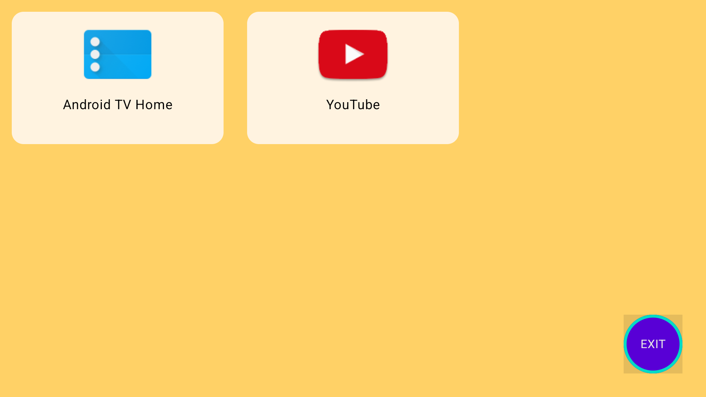
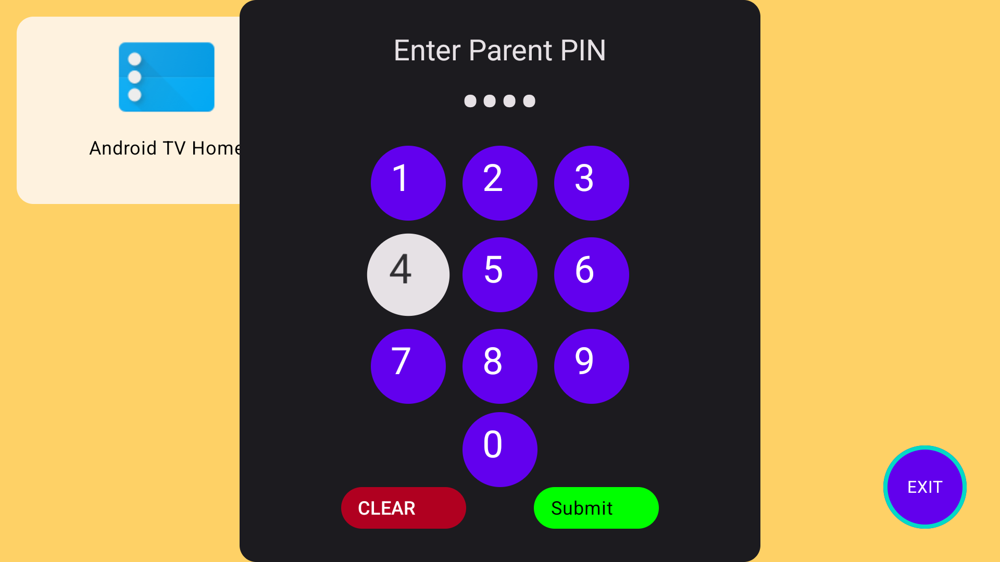
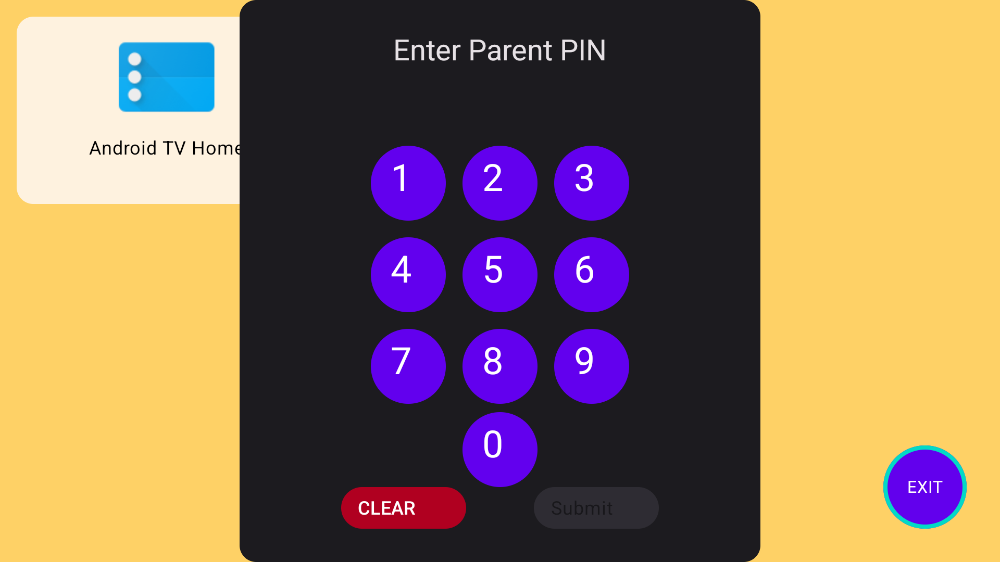

# Kids TV Launcher 🚀

A secure Android TV launcher designed for children, featuring app restrictions and parental controls.




## 📱 Features

### 🎨 Kid-Friendly Interface
- Colorful grid layout with large icons
- D-pad remote navigation support
- Pre-approved apps only (YouTube, etc.)

### 🔒 Parental Controls
- 4-digit PIN protected exit
- Blocks access to system settings
- Prevents app installations

### 🛡️ Security
- Restricted app launching
- No access to non-approved apps
- PIN validation before exiting

## 📸 Screenshots

| Home Screen | PIN Entry | App Selection |
|-------------|-----------|---------------|
|  |  |  |

## 🛠️ Technical Implementation

```kotlin
// Example PIN validation
fun validatePin(enteredPin: String): Boolean {
    return enteredPin == storedPin // Secure PIN comparison
}
